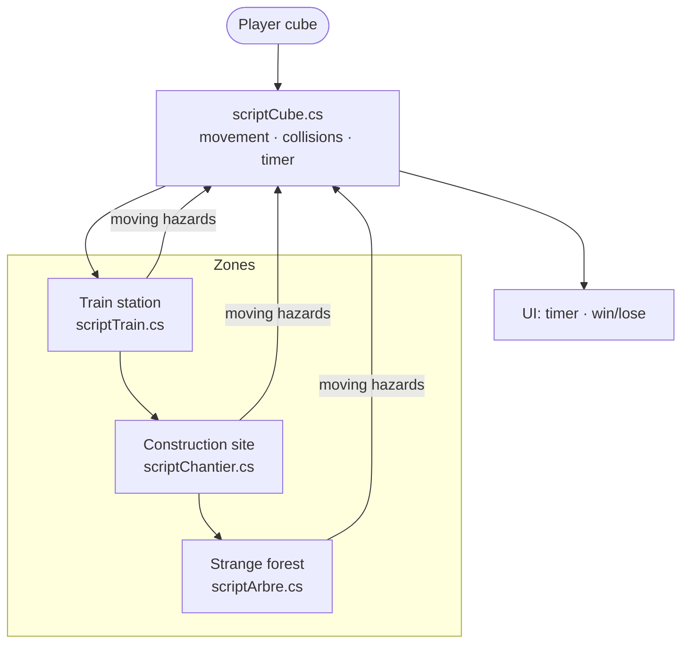
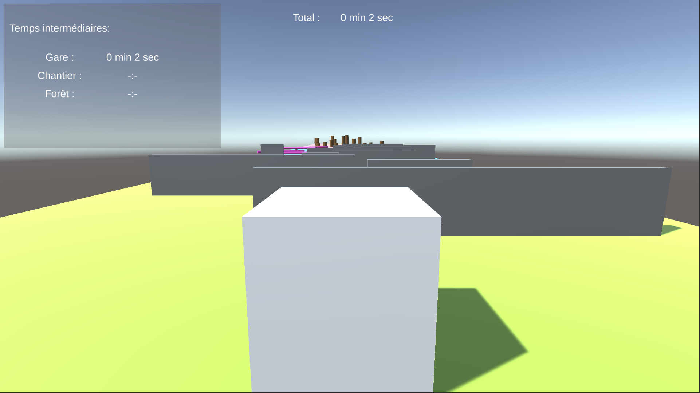
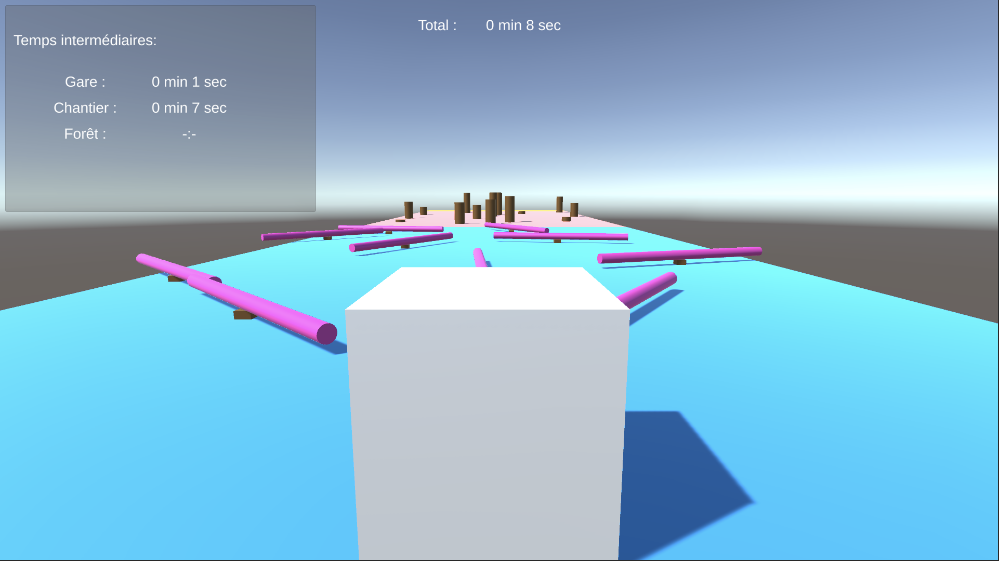
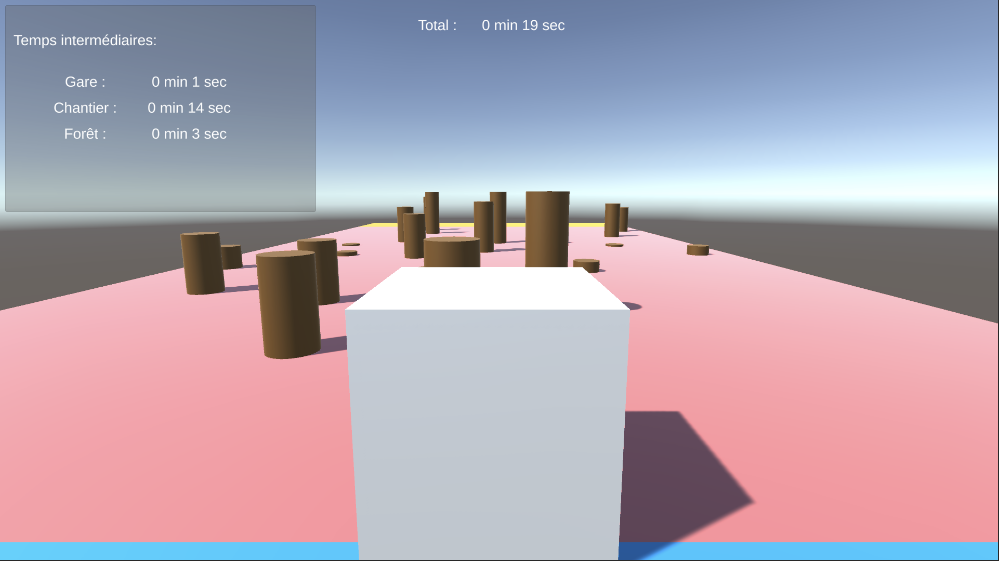
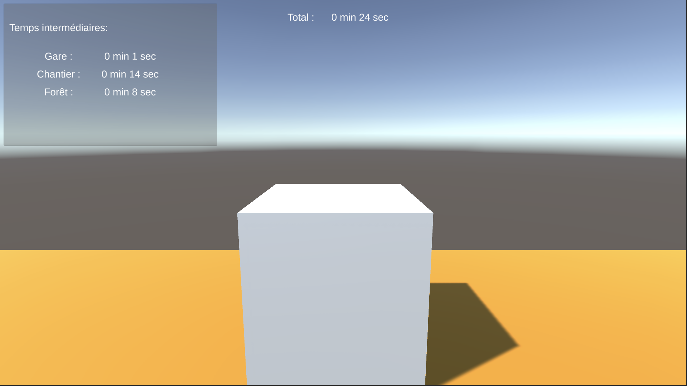

# Zone Rush

# 🚧 Obstacle Challenge Game 🕹️

Welcome to **Obstacle Challenge**, a 3D Unity game where you must guide a cube-shaped player through three increasingly difficult zones—**the train station**, **the construction site**, and **the strange forest**—while avoiding moving hazards and racing against the clock! ⏱️

## Architecture

More detail: [docs/ARCHITECTURE.md](docs/ARCHITECTURE.md)

## 🎮 How to Play

1. Navigate through each zone using your keyboard:
   - `W` / `↑` → Move Forward  
   - `S` / `↓` → Move Backward  
   - `A` / `←` → Move Left  
   - `D` / `→` → Move Right  
2. **Avoid obstacles**—if you collide with one, you’ll be sent back to the beginning of that zone with a time penalty.
3. Your goal is to complete all zones in the **fastest time possible**!

## 🗺️ Game Zones

### 🚉 Zone 1: The Train Station
- 10+ trains move left and right with **random speeds and lengths**.
- Touching a train sends you back to the beginning of the station and adds 1 second to your penalty time.

### 🏗️ Zone 2: The Construction Site
- At least 10 beams (poutres) spin in place with **random speeds, angles, and directions**.
- Contacting a beam restarts the zone and adds another penalty second.

### 🌲 Zone 3: The Strange Forest
- 50+ tree trunks **pop in and out of the ground** with random intervals and speeds, trying to crush you!
- If you get hit, you’re sent back to the forest’s start with time penalties.

### 🏁 Final Zone: The Finish Line
- Once you exit the forest, you reach the finish zone.

## ⏱️ Timing and Penalties

- Your time resets at the start of each zone.
- Every collision adds a **1-second penalty**.
- Your **total time** = sum of all zone times + penalties.

## 💻 Controls

| Action                    | Key    |
| ------------------------- | ------ |
| Move Forward              | W / ↑  |
| Move Backward             | S / ↓  |
| Move Left                 | A / ←  |
| Move Right                | D / →  |
| Skip to Next Zone (cheat) | N      |

## 🏆 Features

- Dynamic obstacles with randomized parameters.
- Responsive camera that follows the player.
- Cheat code support for testing/debugging.
- Penalty system for increased challenge.

## 📦 Built With

- **Unity 3D** (Version 2022.3.17f1)
- **C#**
- Panels, prefabs, materials, and UI components

---

