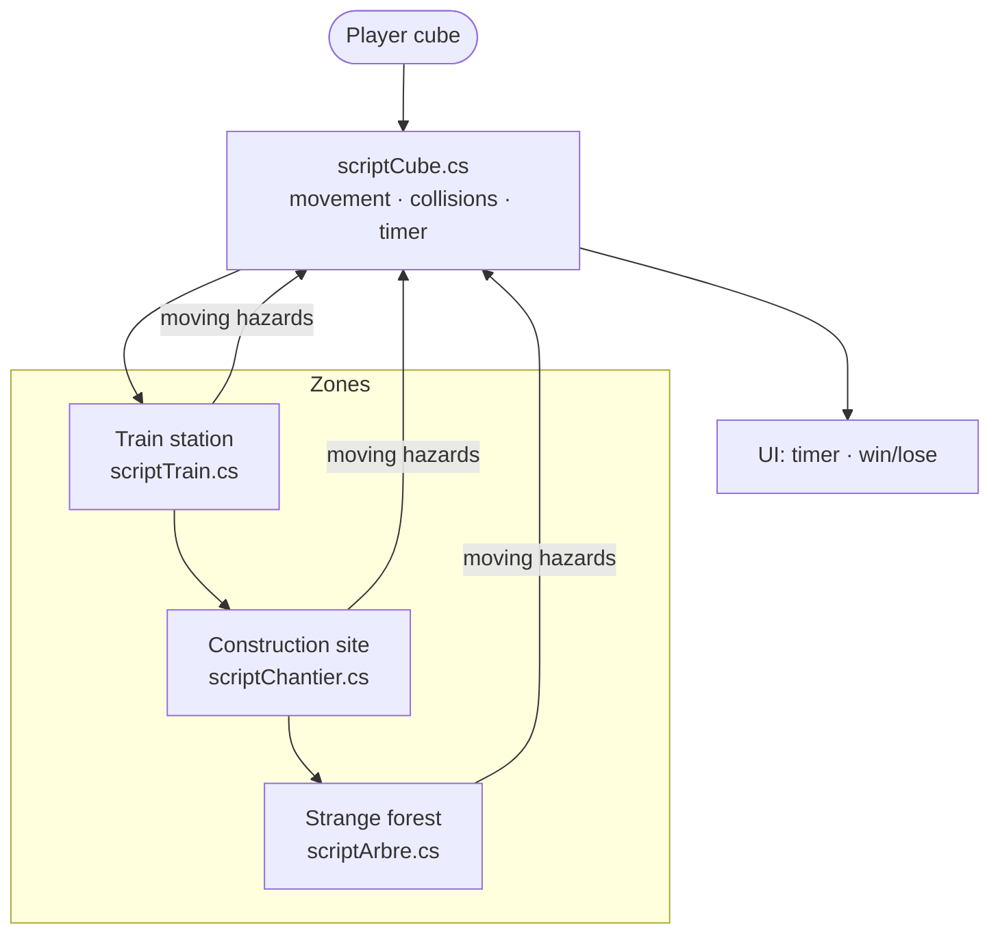

# Architecture

A Unity 3D obstacle game with three zones, each with its own hazard script.

```mermaid
flowchart TD
    Player([Player cube]) --> Cube["scriptCube.cs<br/>movement · collisions · timer"]
    subgraph Zones
        Train["Train station<br/>scriptTrain.cs"]
        Site["Construction site<br/>scriptChantier.cs"]
        Forest["Strange forest<br/>scriptArbre.cs"]
    end
    Cube --> Train --> Site --> Forest
    Train & Site & Forest -->|moving hazards| Cube
    Cube --> UI[UI: timer · win/lose]
```
